# 1. Centralized Data Ingestion Service with Aiven Kafka
## A quick start for Java and Springboot
Aiven for Apache Kafka is a fully managed distributed data streaming platform, deployable in the cloud of your choice. Apache Kafka is an open source data streaming platform, ideal for event-driven applications, near-real-time data transfer and pipelines, stream analytics, and many more applications where a lot of data needs to move between applications in a speedy manner.

Data platform developers or application developers need to ingest the data generated by applications to Kafka cluster for stream processing. Based on Aiven Kafka, this tutorial presents how to use Springboot framework to build a Kafka producing service. The tutorial contains 4 steps, including create an Aiven Kafka Service, setting up Java SSL access, Springboot integration, and local testing. 

At the second section of this tutorial, you will also find guidelines on how to integrate Kafka metrics with Aiven InfluxDB and Grafana to empower your service monitoring. 

## 1.1 Create Aiven Kafka Service

Aiven services are managed in the Aiven web console . When you first log in to the console with your email address and password, you will see the Services view, which shows you all the services in the currently selected project.

Create a new Aiven for Apache Kafka® service:

1. Select Kafka as the service type. You can also select the version that you want to use.

2. Select the cloud provider and region that you want to run your service on.

3. Select a service plan. This defines how many servers and what kind of memory, CPU, and disk resources are allocated to your service.

4. Enter a name for your service. A random name is provided by default, but you can enter a more recognizable name to distinguish it from other services.
   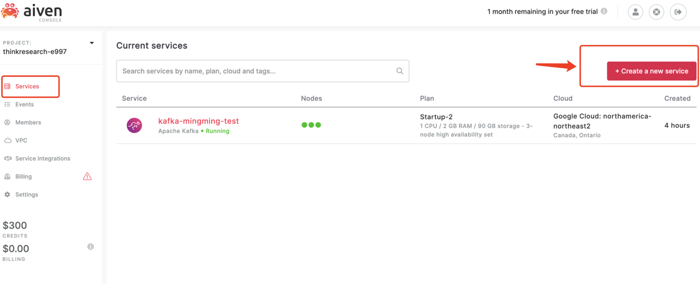
5. Click Create Service under the summary on the right side of the console. This brings you back to the Services view. Your new service is listed with a status indicator to show that it is being created.

6. While your service is being built, you can visit the Service overview page and see the status change from REBUILDING to RUNNING.

7. After your Kafka service is up and running, you can create a kafka topic based on your own configure preference.
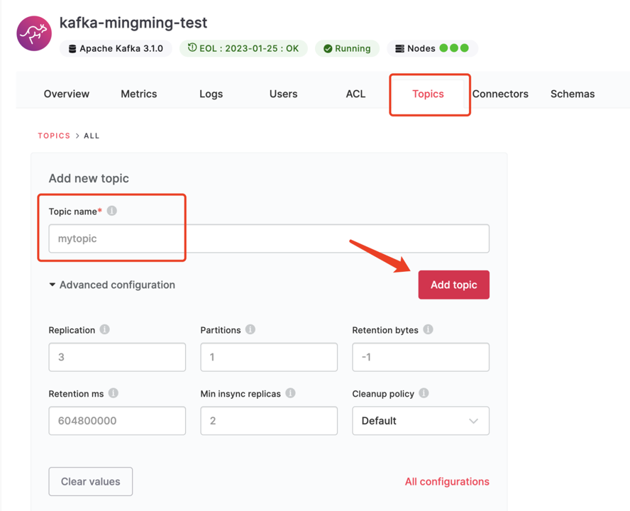

## 1.2 Configure Java SSL Access
Now that you have created an Aiven Kafka service and a topic, you will need to set up SSL access so that your Java code can access and produce data.

Aiven for Apache Kafka® utilises TLS (SSL) to secure the traffic between its services and client applications. This means that clients must be configured with the right tools to be able to communicate with the Aiven services.

Keystores and truststores are password-protected files accessible by the client that interacts with the service. To create these files:

- Log into the Aiven web console and select your Aiven for Apache Kafka service.

- Download the Access Key, Access Certificate and CA Certificate, as is shown on the picture. The resulting **service.key**, **service.cert** and **ca.pem** are going to be used in the following steps.


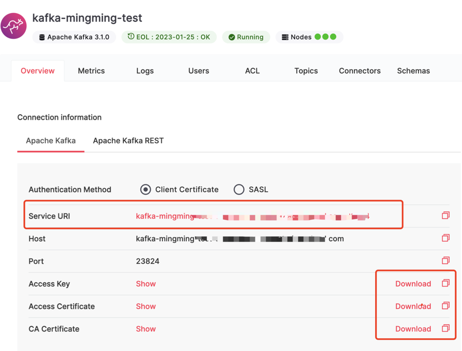
- Use the openssl utility to create the keystore with the service.key and service.cert files downloaded previously:
```
openssl pkcs12 -export       \
-inkey service.key        \
-in service.cert           \
-out client.keystore.p12 \
-name service_key      
```
- Enter a password to protect the keystore and the key, when prompted.
- In the folder where the certificates are stored, use the keytool utility to create the truststore with the ca.pem file as input:
 ```
keytool -import  \
  -file ca.pem \
  -alias CA    \
  -keystore client.truststore.jks
```

- Enter a password to protect the truststores, when prompted. Reply to yes to confirm trusting the CA certificate, when prompted.
- The result are the keystore named client.keystore.p12 and truststore named client.truststore.jks that can be used for client applications configuration. 
- Make sure **kafka_authentication_methods.certificate** is enabled on the bottom of the overview page of your Kafka service.
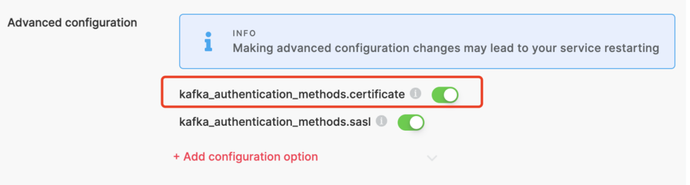

## 1.3 Java Springboot Integration 

The code repo is based on Springboot framework, provides API service for batch data ingestion. It contains mainly 4 packages, including controller, producer, service, and conf. Application.java is the entry of the service.

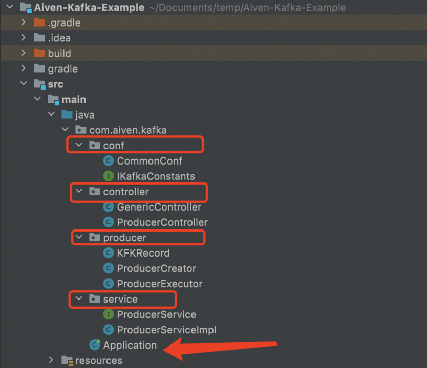

The API for batch data ingestion is  */avian/kafka/produce/batch*, 
you can access the api through url like : *http://localhost:8082/avian/kafka/produce/batch*

The producer package further encapsulated classes for producing data:
```
ProducerExecutor producerExecutor = new ProducerExecutor();
producerExecutor.produce(new KFKRecord(topic,message));
```
Aiven Kafka connection related configuration can be updated by changing 
the *IKafkaConstants.java* in the conf package:
```
    String BOOTSTRAP_SERVERS = "THE-URL-ON-YOUR-AIVEN-KAFKA-SERVICE.aivencloud.com:23824";
    String SSL_TRUSTSTORE_LOCATION="/YOUR-OWN-PATH-TO/client.truststore.jks";
    String SSL_TRUSTSTORE_PASSWORD="YOUR-OWN-PASSWORD";
    String SSL_KEYSTORE_TYPE= "PKCS12";
    String SSL_KEYSTORE_LOCATION="/YOUR-OWN-PATH-TO/client.keystore.p12";
    String SSL_KEYSTORE_PASSWORD="YOUR-OWN-PASSWORD";
    String SSL_KEY_PASSWORD="YOUR-OWN-PASSWORD";
```

## 1.4 Local Testing
Start the service locally through IDEA or other tools by running the *Application.java*.
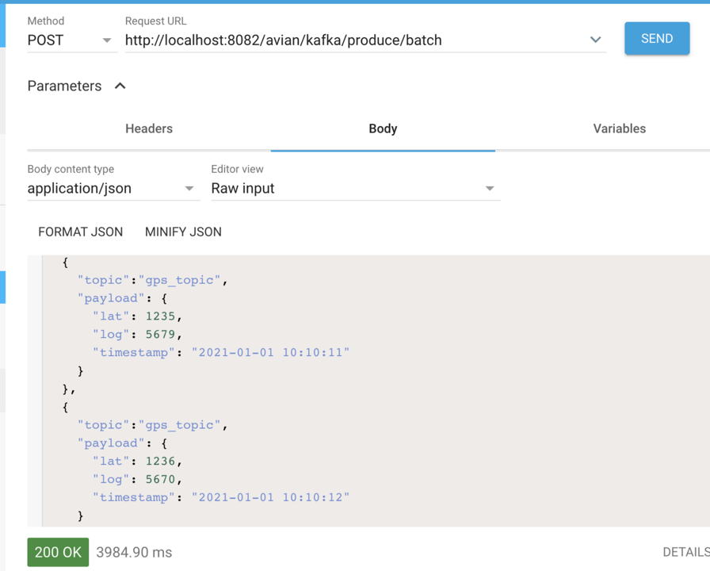
The payload should be a JSONArray, with multiple JSONObject elements.
Previously, we have created a topic named *gps-topic*, so the payload looks like:
```
[
  {
    "topic":"gps_topic",
    "payload": {
      "lat": 1235,
      "log": 5679,
      "timestamp": "2021-01-01 10:10:11"
    }
  },
  {
    "topic":"gps_topic",
    "payload": {
      "lat": 1236,
      "log": 5670,
      "timestamp": "2021-01-01 10:10:12"
    }
  }
]
```
You can use postman or ARC as client to send the payload to the api. The service will produce the data to the topic specified in your payload.
After the client received 200OK, you should see the data in Aiven Kafka topics. 

- Go to Aiven Kafka service, click *topics*.
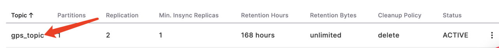
- Go to the topic list and click the topic name that you just produced data.
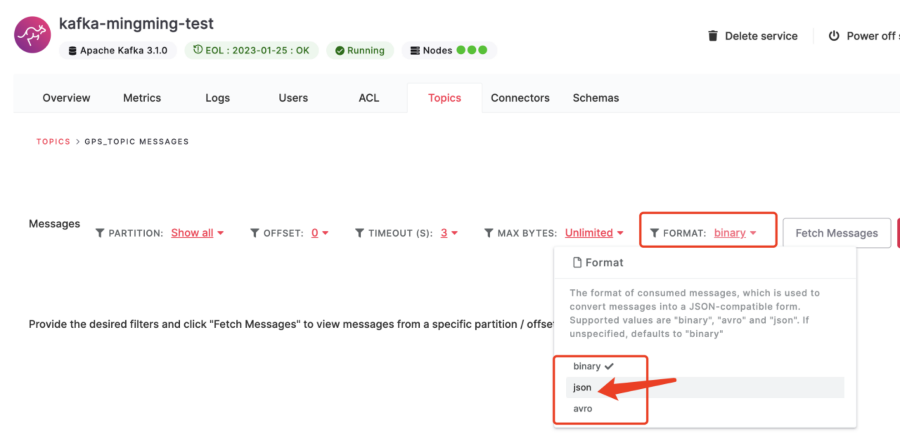

- Change the Format from binary (default) to json, then click *Fetch Messages*. You should see the data you just produced. 
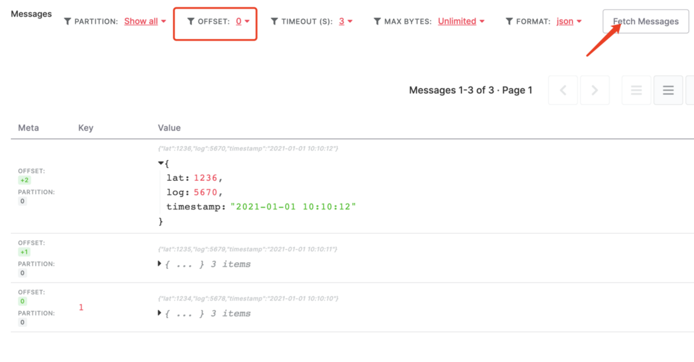

- Note that for easier debugging, you can also specify the offset for pulling the data.


# 2. Empower Your Service Monitoring


**Aiven Service Integrations** provide additional functionality and features by connecting different Aiven services together. With Aiven service integrations, basic host-level resource metrics (CPU, memory, disk and network) and logs for every service can be automatically collected and integrated. This advanced telemetry feature brings much more detailed, service-specific metrics to Aiven users, who can then drill down into the service behavior and identify issues and performance bottlenecks.

This tutorial demonstrates how to easily empower your service behavior monitoring with Aiven-Service-Integrations.


## 2.1 Service Preparation
To get started, you will need three services created and launched through Aiven Console:
- **Aiven for Apache Kafka** - The service that produces the telemetry data
- **Aiven for InfluxDB / PostgreSQL** - Database where the telemetry data is stored and can be queried from
- **Aiven for Grafana** - Dashboards for the telemetry data
 
Now that the services are up and running, you should see the following running status. 
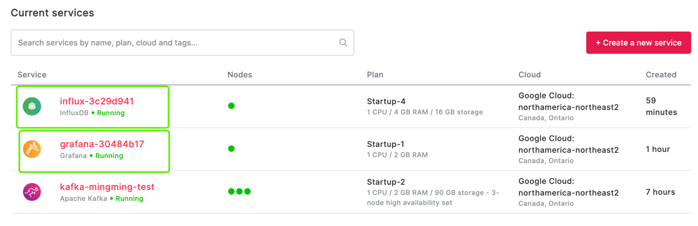

## 2.2 Service Integration
Once the services are launched, you can open the overview page of InfluxDB service and find the Service Integrations section within it:
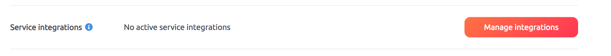

Currently, the status is *No active service integrations* as we have not yet activated any. Click the Manage integrations button and a list of available integrations opens up.

Select *Datasource* and *Metrics*, to easily enable integration with the grafana and kafka service you previously launched.
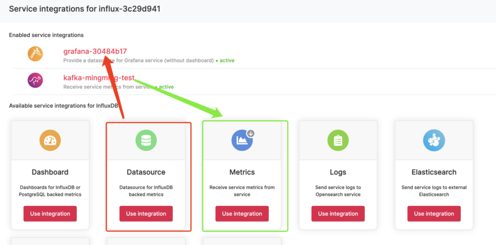
That is all that is needed to get the advanced Kafka telemetry data flowing to the InfluxDB service, then being monitored in Grafana! 
## 2.3 Login into Grafana

Now, let's open the Grafana dashboard to see the data by going back to the service list and selecting the Grafana service:
Open the *Service URI* displayed on the *Overview* page of Grafana service with any web browser. 
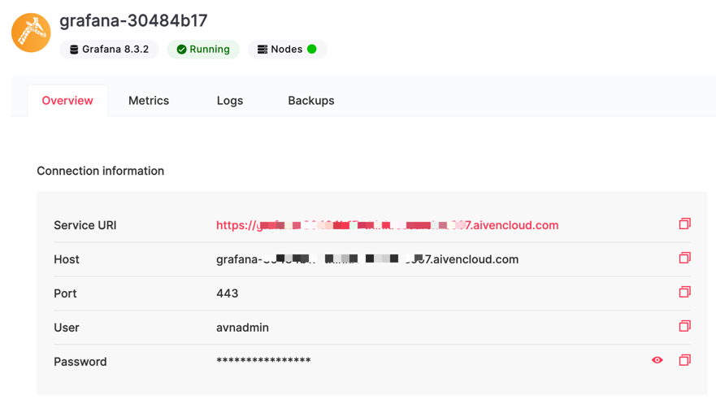

You should see a login page. Now, use the username and password on the Grafana service to login into Grafana. 
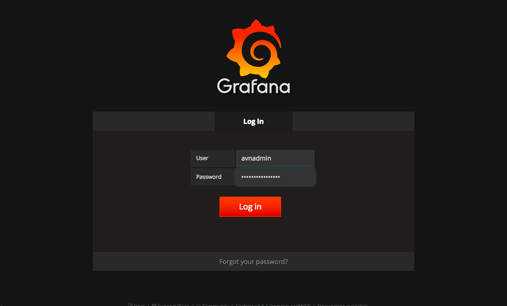

## 2.4 Explore Your Service Metrics Through Grafana!
The Grafana default view opens showing that we have one dashboard available:
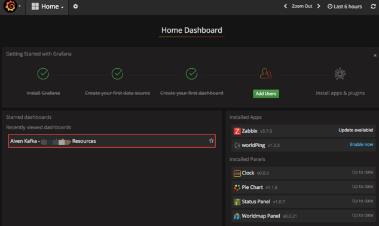

Click the dashboard name "Aiven Kafka - *YOUR DASHBOARD* - Resources" to open up the Kafka metrics dashboard:
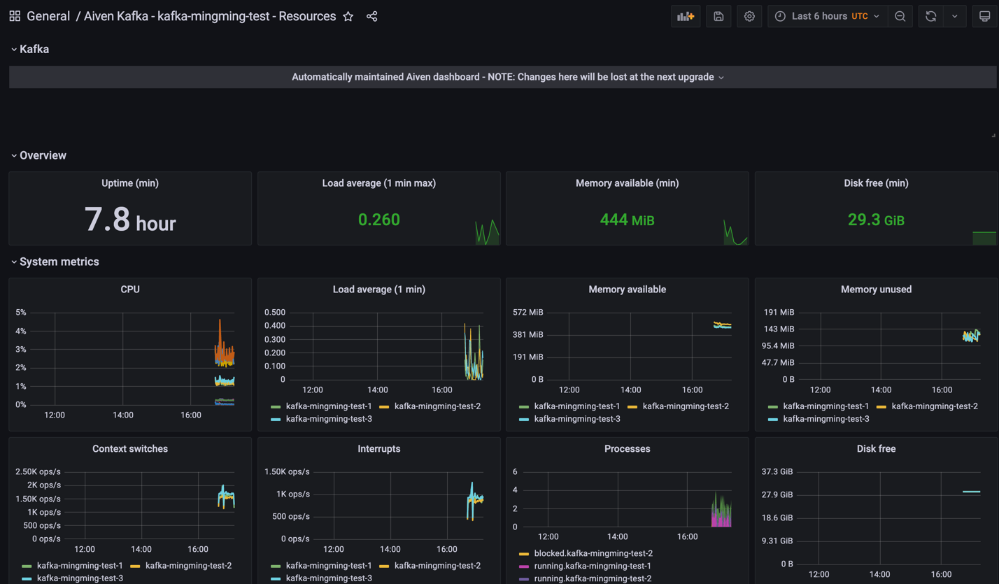

This dashboard is a predefined view that is automatically maintained by Aiven.

Congrats! You are all set!

Note that it may take a minute to start getting data into to the dashboard view if you just enabled the integrations. The view can be refreshed by pressing the reload button at the top-right corner.